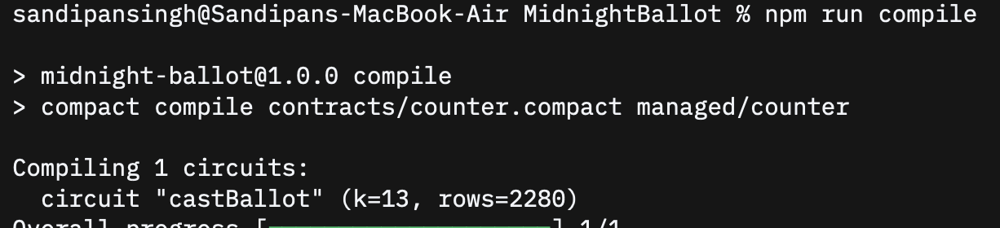
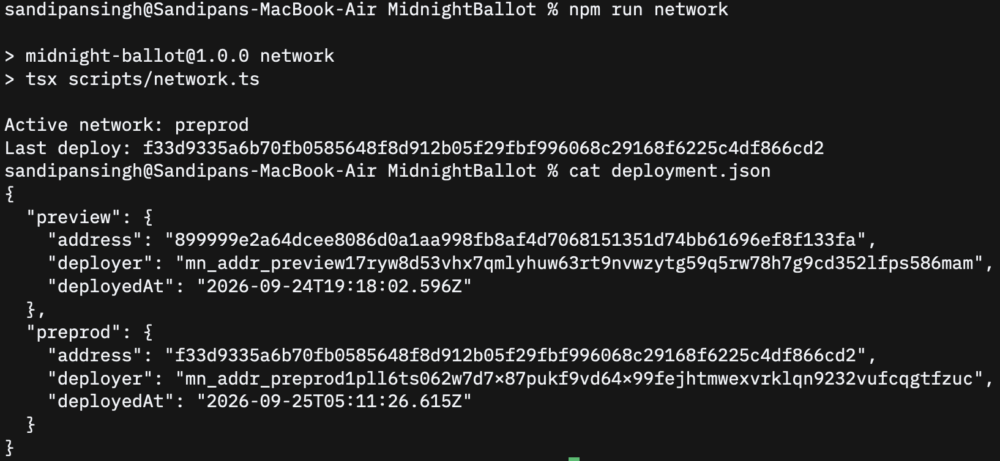

# MidnightBallot
> A privacy-preserving DAO governance platform, beginning with a private ballot commitment contract on Midnight.

## Contract Address

| Network | Address |
| --- | --- |
| Preview | `899999e2a64dcee8086d0a1aa998fb8af4d7068151351d74bb61696ef8f133fa` |
| Preprod | `f33d9335a6b70fb0585648f8d912b05f29fbf996068c29168f6225c4df866cd2` |

The addresses in this table are for **this project's `contracts/counter.compact` contract**. The separate `mn-demo/` hello world scaffold was also deployed to validate the toolchain; it is not the MidnightBallot contract. The project deployments are recorded in [`deployment.json`](deployment.json).

## What This Does

`castBallot` asks a local witness for a Boolean choice and a fresh, random 32-byte nonce. Its circuit hashes that ballot, deliberately discloses only the hash commitment, rejects an exact duplicate commitment, and increments a public `ballotCount`. Anyone can verify the turnout count and the list of commitments without reading the choices or nonces.

This Level 1 contract demonstrates a private ballot commitment and public turnout. It does **not** tally votes by choice or enforce one vote per person: a caller can submit another ballot with a new nonce. The planned platform will add proposals, private eligibility proofs, election boundaries, and a verifiable final tally. Use a new high entropy nonce for every ballot; a weak or reused nonce can undermine choice privacy.

## Privacy Model

- **PUBLIC (on chain, visible to anyone):** `ballotCount`, the `ballotCommitments` set, the disclosed hash for each accepted ballot, and normal transaction metadata.
- **PRIVATE (local witness, never written to the ledger):** the Boolean `choice` and 32-byte `nonce` returned by `privateBallot`. The wallet recovery phrase and seed also stay in local, gitignored files.
- **PROVED without revealing:** the caller knows a well-formed private ballot whose hash is the published commitment, and that this exact commitment was not already in the set. The proof does not establish voter identity or eligibility.

`disclose()` is used only on the computed commitment. The choice and nonce are not passed to it. The tests inspect the public ledger and public transcript for private ballot data.

## Tech Stack

- Midnight Preview and Preprod networks and the Compact language
- Compact devtools 0.5.2 with compiler toolchain 0.31.1 and ledger v8.1.2
- Node.js v24 (used for this deployment; the app requires Node.js 22 or newer) and npm
- Docker Desktop with Compose and `midnightntwrk/proof-server:8.1.0`
- TypeScript, Midnight.js, and Node's test runner

## Prerequisites

1. Node.js 22 or newer and npm. This project was built and tested with Node.js v24.21.0.
2. Docker Desktop running with Docker Compose v2 and port 6300 free.
3. The [Compact devtools](https://github.com/midnightntwrk/compact/releases) and compiler toolchain 0.31.1 on your `PATH`.
4. Network access to Midnight Preview or Preprod. Deployment requires a wallet funded with tNIGHT on the selected network; registered NIGHT generates the DUST used for fees.

The originally suggested npm package `@midnight-ntwrk/compact-compiler` was unavailable from npm during setup. The [official Compact installer](https://github.com/midnightntwrk/compact/releases) supplied the working toolchain. The scaffold pins proof server 8.1.0; the unversioned `midnightnetwork/proof-server` image stalled during proof generation on this Apple Silicon machine.

## Setup

```sh
git clone https://github.com/sandipansingh/MidnightBallot.git
cd MidnightBallot
npm install
```

Install and select the matching Compact toolchain if it is not already installed:

```sh
curl --proto '=https' --tlsv1.2 -LsSf \
  https://github.com/midnightntwrk/compact/releases/download/compact-v0.5.2/compact-installer.sh | sh
source "$HOME/.local/bin/env"
compact update 0.31.1
compact compile --version
```

Compile, start the compatible local proof server, and check the project:

```sh
npm run compile
npm run proof-server:start
npm run build
npm test
```

To deploy your own copy to Preview or Preprod, run the matching command:

```sh
NODE_OPTIONS="--max-old-space-size=12288" npm run deploy:preview
NODE_OPTIONS="--max-old-space-size=12288" npm run deploy:preprod
```

On a fresh checkout, each network's deploy command creates a local wallet and prints its recovery phrase and public address. Save the recovery phrase privately, fund the address at the matching [Preview faucet](https://midnight-tmnight-preview.nethermind.dev) or [Preprod faucet](https://faucet.preprod.midnight.network/), and let the command finish. Each contract address is written to `deployment.json`. `.midnight-state.json`, `.midnight-wallet-state/`, and private state stores contain local secrets and are gitignored; keep them out of screenshots and commits.

The `mn-demo/` directory is the separate hello world scaffold used for the required initial Preview deploy. To run that demo again, install its dependencies with `npm --prefix mn-demo install`, compile it with `npm --prefix mn-demo run compile`, and use its own scripts.

## Run Tests

```sh
npm run compile
npm test
```

The three tests check that the private choice changes the hash commitment, accepted ballots update turnout while an exact replay fails, and the public ledger and transcript contain the commitment without the private ballot. `npm run build` also typechecks the TypeScript files.

## Project Structure

```text
contracts/counter.compact       Compact ballot commitment contract
managed/counter/               Generated circuit, JavaScript bindings, and keys
src/                           Reserved for the Level 2 frontend
tests/counter.test.ts           Contract runtime tests
scripts/                        Preview and Preprod deployment and wallet support
.github/workflows/              Reserved for Level 3 CI/CD
mn-demo/                        Separate hello world scaffold and deploy
README.md                       This guide
package.json                    Root build, test, and deploy commands
```

## Initial Idea

**MidnightBallot** is a privacy-preserving DAO governance platform on Midnight. Traditional voting can reveal a member's wallet, token balance, and choice, creating social pressure and exposing voting behavior. The planned platform will let members prove eligibility and cast private votes while publishing a verifiable final result, with a simple interface for proposals and election rules. This Level 1 contract establishes private ballot commitments and public turnout; eligibility checks, one vote per member, and final tallying are planned features.

## Level 1 Verification

| Requirement | Evidence |
| --- | --- |
| Contract compiles | `npm run compile` completes and generates the `castBallot` circuit. |
| Tests pass | `npm test` runs three passing contract tests. |
| Generated circuits and keys | `managed/counter/zkir/` and `managed/counter/keys/`. |
| Contract deployed | Preview and Preprod addresses are listed above and recorded in [`deployment.json`](deployment.json). |
| Public and private data explained | See [Privacy Model](#privacy-model). |

## Screenshots

### Compact compile output



### Deployed contract addresses


